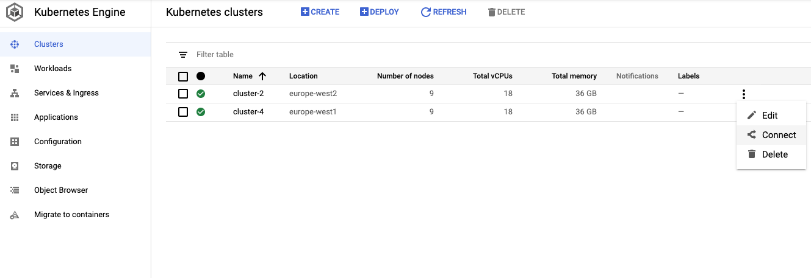

# Terraform GCP Consul Helm

> :warning: **Warning:** This code is not designed to be used in production without (heavy?) modifications

This code uses Terraform to deploy a Consul Enterprise Cluster using a GCP K8s cluster.

It will not setup the K8s cluster, you have to provide it yourself.

It can also setup a secondary Consul Cluster and connect it via Mesh Gateways.

This requires a secondary K8s cluster with the Consul Federation secrets imported into it.

## Setup

In GCP:

1. Create a project (optional)
2. Create a service account
   1. Assign the "Owner" role^1^
   2. From the Service Accounts section, select the account and then create a new key (select JSON for key type)
   3. Save JSON file
3. Create 1 or 2 Kubernetes clusters (you'll need to try Federation)

^1^ Or if you want to do this the right way, create a new role with the correct permissions. I didn't want to waste time doing that for my tests so I just went the lazy way instead.

### Kubernetes Cluster

I've used e2-micro with 3 nodes (1 node per zone) to keep costs down. The default pool settings can rack up some serious money quickly.

### Consul License

The code deploys Consul Enterprise, so it requires a Consul license.

### Consul Federation

To stand up a secondary Consul cluster, you first need to export the configuration from the primary cluster and import it to the secondary. The code doesn't do this automatically.

The easiest way to do this, is from the built-in cloud shell in GCP.

1. Login to the GCP console
2. Select the Kubernetes Engine from the GCP console
3. Navigate to the Clusters page
4. For each cluster, select "connect" from the ellipsis menu (see image below)



Once you're done, you can verify that you have all the contexts configured with this command:

```shell
kubectl config get-contexts
```

Now you can use these commands to export the Consul Federations secrets from the primary cluster and then import them in to the secondary one.

```shell
kubectl config use-context <PRIMARY_CLUSTER_CONTEXT>
kubectl get secret hashicorp-consul-federation -o yaml > consul-federation-secret.yaml
kubectl config use-context <SECONDARY_CLUSTER_CONTEXT>
kubectl apply -f consul-federation-secret.yaml
```

Replace `<PRIMARY_CLUSTER_CONTEXT>` and `<SECONDARY_CLUSTER_CONTEXT>` above with the context name of your primary and secondary clusters respectively.

For more info, see the [documentation](https://www.consul.io/docs/k8s/installation/multi-cluster/kubernetes#federation-secret)
